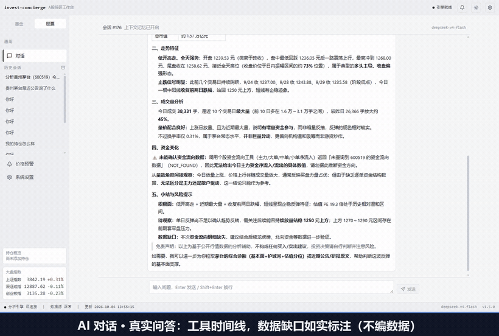
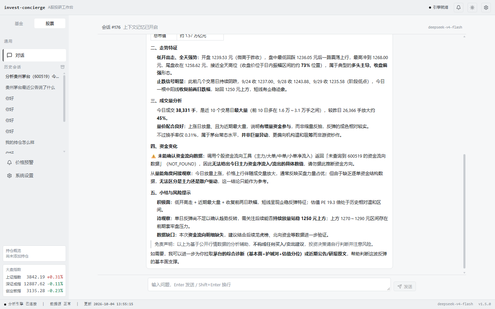
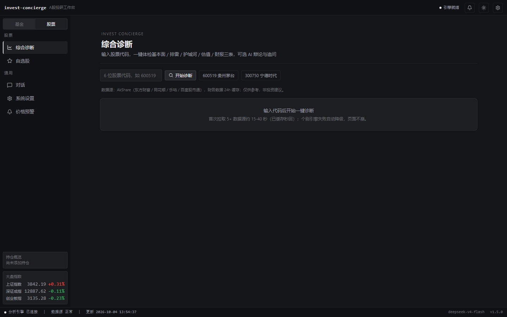
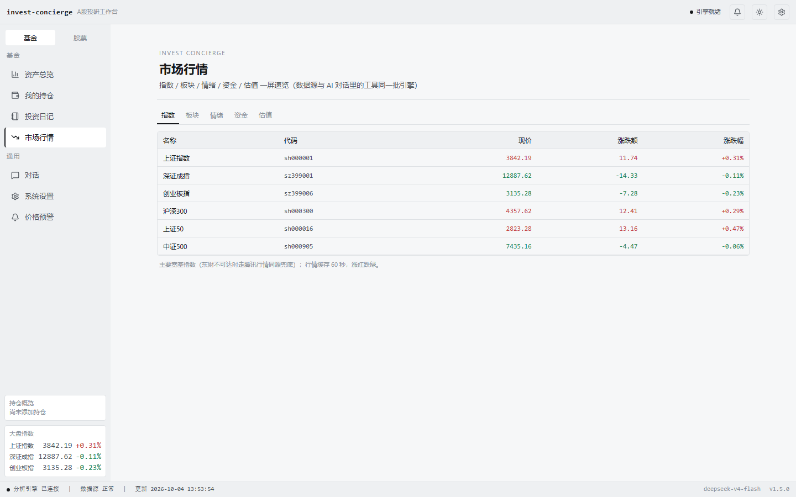
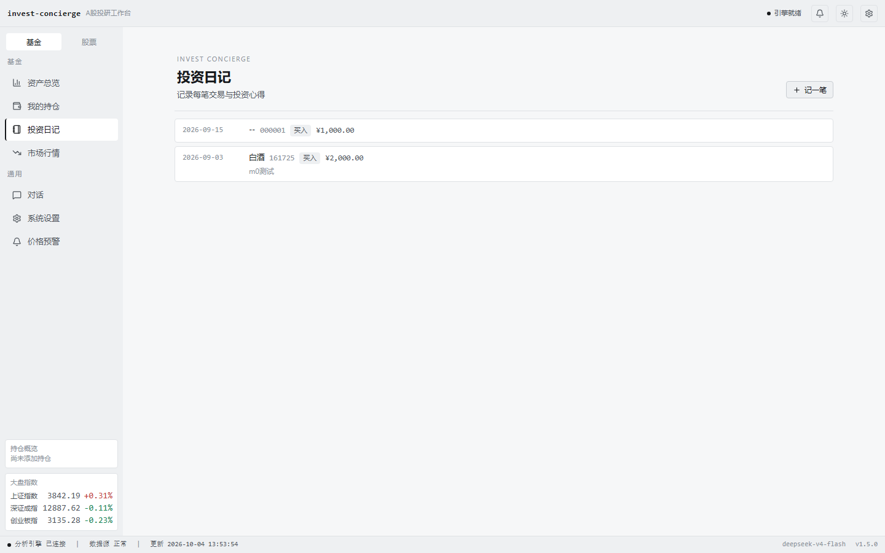
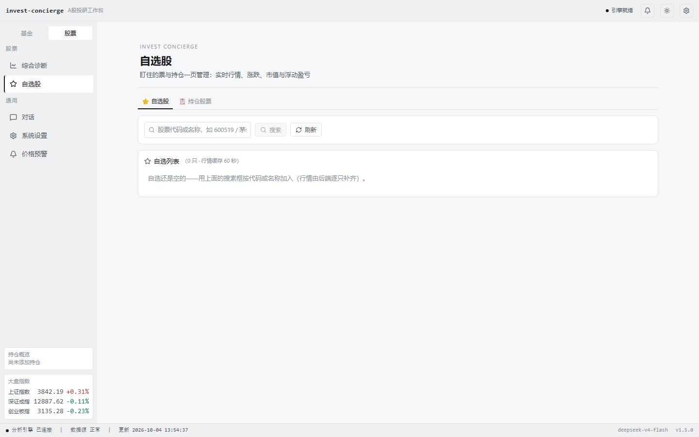
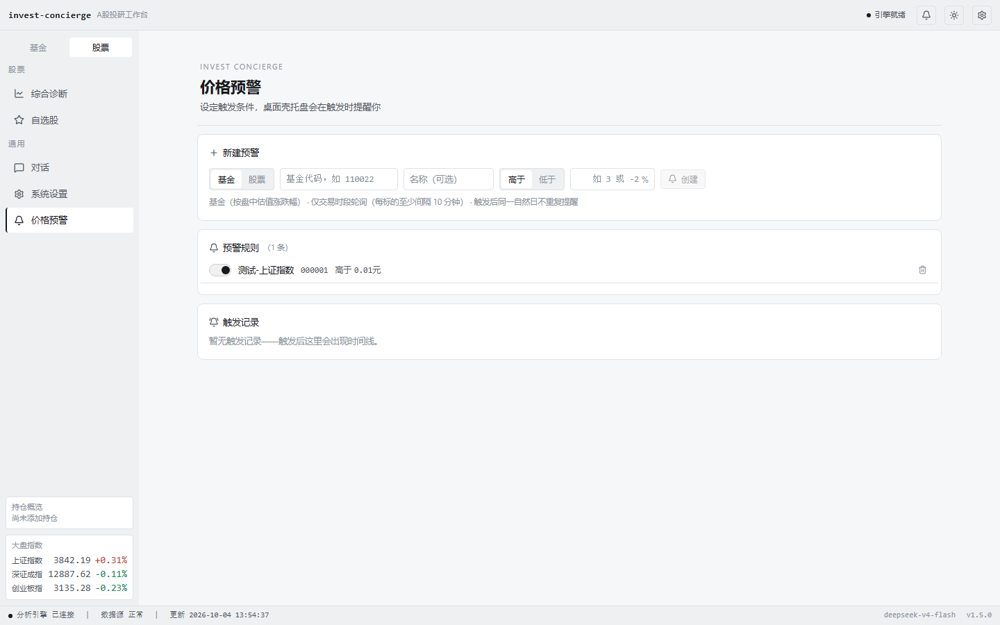
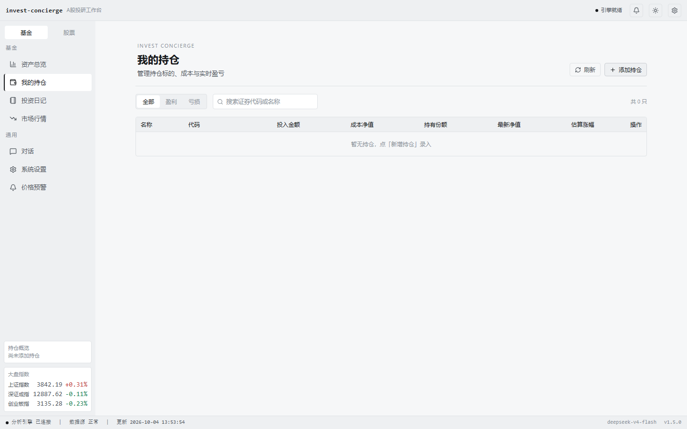
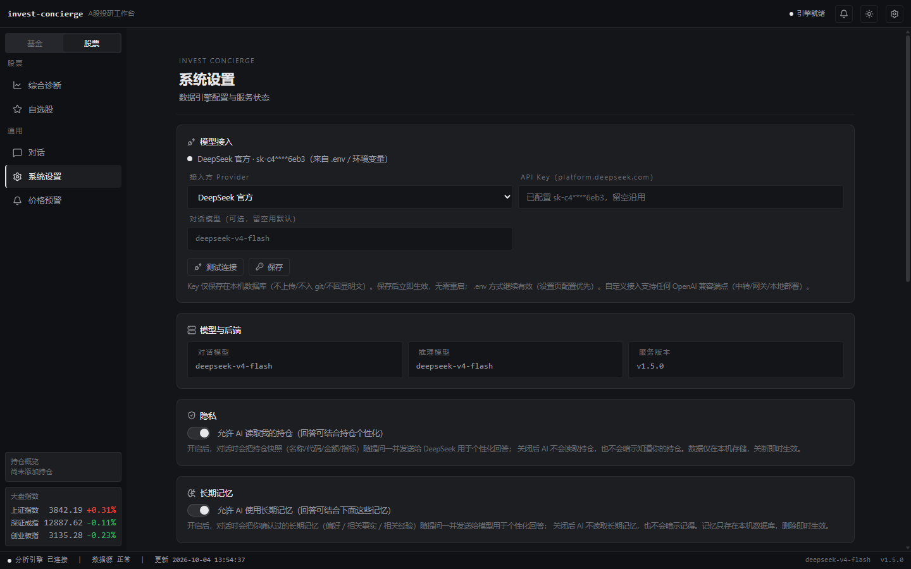
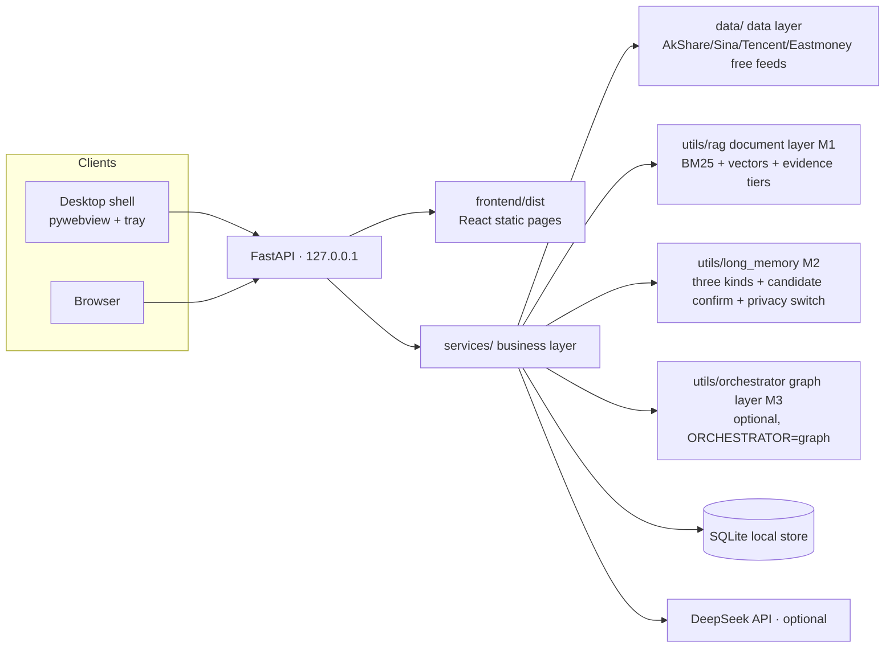

# Invest Concierge

[](https://github.com/cx-ssg/invest-concierge/actions/workflows/ci.yml)
[]()
[]()

> Open-source A-share & fund AI personal investment assistant. Free data, desktop & web.
> 中文版：[README.md](README.md)

## 🖼️ Screenshots



*↑ 37-second demo (GIF 1.1 MB / [MP4](assets/demo/invest-concierge-demo.mp4) also available): a real run, including one real AI Q&A.*

| AI chat (real run · tool timeline + honest data-gap note) | Stock · diagnosis |
|:---:|:---:|
|  |  |

| Market overview · 5 tabs (live index data) | Fund · investment diary |
|:---:|:---:|
|  |  |

| Stock · watchlist | Price alerts |
|:---:|:---:|
|  |  |

| Fund · portfolio | Settings (model / privacy / long-term memory) |
|:---:|:---:|
|  |  |

*Light / dark themes, one-click toggle in the top-right corner. Screenshots taken from a **real local run on 2026-10-04 (v1.5.0)**; market data is that day's real quotes.*

## ⚠️ Disclaimer (read first)

- For **educational and research purposes only**. Not investment advice, not a basis for trades.
- Markets carry risk; you alone bear the consequences of your decisions.
- Data comes from free public APIs (AkShare / Eastmoney / Sina etc.) and may be delayed or wrong — always check official disclosures.

## ✨ What It Is

An open-source **A-share and fund analysis assistant**: no paid data feeds, works right after cloning. Built-in AI (optional DeepSeek key) translates financial reports, valuation and fund flows into plain language.

7 live pages today (React frontend, desktop shell / browser):

| Page | Description |
|---|---|
| 💬 AI chat (home) | Investment Q&A: SSE streaming + native reasoning chain + tool-call timeline (**31 tools**: quotes / reports / valuation / fund flows / search / backtest / document retrieval / dragon-tiger & limit-up…) |
| 📊 Fund · dashboard | Total assets and P&L overview |
| 💼 Fund · portfolio | Track holdings, P&L and daily real-time estimates |
| 📔 Fund · diary | Record the reasoning behind every trade |
| 🩺 Stock · diagnosis | Six engines: fundamentals / financial minefields / moat / valuation / financial statements / AI debate |
| 🔔 Price alerts | Price-threshold rules + trigger event timeline (evaluation runs in a low-frequency backend scheduler; desktop shell shows a tray balloon) |
| ⚙️ Settings | API key status / app info / long-term memory management (M2) |

> 🚧 **In progress**: backtest / DCA / fund comparison / limit-up review are **already available as agent tools** (callable from AI chat); their dedicated pages are still on the roadmap — see [docs/ROADMAP.md](docs/ROADMAP.md).

**Capability layers (M1 / M2 / M3 all ship with the source)**:

| Layer | In one line | Entry point |
|---|---|---|
| **M1 · Private document layer** | Local filings / research-note corpus → BM25 + `bge-m3` hybrid retrieval (RRF fusion), returning source snippet + document + date | Tool `retrieve_docs` (one of the 31 agent tools) |
| **M2 · Long-term memory** | Three memory kinds stored and recalled separately (preferences **injected on every turn** / facts **by ticker** / experiences **vector top-3**); writes go through "candidate → user confirmation", **the AI never writes memory on its own** | Settings page "Long-term memory" block (list / delete / confirm candidates / **recall preview**) |
| **M3 · Graph orchestration (optional)** | Only active with `ORCHESTRATOR=graph`; **default `legacy`, behaviour unchanged**; graphifies a single "stock diagnosis" chain to gain checkpoint resume + human review | `POST /api/stocks/{code}/diagnosis/review` + SQLite checkpoint |

**New in v1.3.0 → v1.3.2 (current capabilities; full caveats in the sections below and in [docs/RELEASE_NOTES_v1.3.2.md](docs/RELEASE_NOTES_v1.3.2.md))**:

| Capability | What it does |
|---|---|
| **Citation back-jump** | The `[n]` markers in retrieved-answer text are **clickable superscripts**, with source cards below showing **title / date / link** |
| **LLM judge (A3b)** | **Asynchronous** (`done` first, `evidence_judged` later) · **triggered only on the `weak` tier** (`none` abstains, so zero judge calls) · the judge's quote must match the source chunk **verbatim** (deterministic check) · **any failure degrades** to `uncertain`; source cards carry the judge's verdict |
| **Replay shows sources** | Opening an **old session** also shows source cards and judge annotations (since v1.3.1, persisted in `agent_messages.meta`); **old messages are not back-filled** (`meta = NULL` ⇒ no source block) |
| **M2 long-term memory + memory-management UI** | Three memory kinds **stored and recalled separately**; writes go through "candidate → user confirmation" (**the AI never writes memory on its own**); the settings page supports list / delete / confirm candidates / **recall preview** (see the M2 section below) |
| **Multi-ticker corpus + query-side scope detection** | A self-built corpus of **65 docs / 2111 chunks** (Kweichow Moutai + Wuliangye + Luzhou Laojiao + Shanxi Fenjiu); the new `query_scope` narrows the pool only when a ticker is recognised, suppressing **cross-ticker contamination** (caliber in the evaluation section) |

## 🚀 Quick Start (four ways, pick one)

### Option 1 — Download the installer (zero Python environment)

> ⚠️ **Version & download caveat (please read)**: both the newest tag and the **latest GitHub Release are `v1.3.2`**
> (`Releases/latest` points to it, released 2026-10-04).
> **But the latest Release does not necessarily carry installer assets**: the release notes for `v1.1.0` / `v1.2.0` / `v1.3.0`
> all state "no rebuilt installer this time", and `v1.3.1` / `v1.3.2` are patch releases whose notes do not mention asset changes
> ⇒ **download whatever assets the `Releases/latest` page actually lists**; if that page has no exe, get the installer from the
> [v1.0.0 Release](https://github.com/cx-ssg/invest-concierge/releases/tag/v1.0.0)
> (the `v1.1.0` / `v1.2.0` / `v1.3.0` notes all record that the installer lives there).
> **The bundled exe corresponds to v1.0.0 code; M1 / M2 / M3 and later capabilities are source-only — do not treat the installer as the latest code.**
> Use Option 2 below for the new features, or build the installer yourself following `docs/PACKAGING.md`.

Download from [Releases](https://github.com/cx-ssg/invest-concierge/releases/latest):

- **`invest-concierge-setup-v*.exe`** — installer, double-click (per-user, no admin), creates Start-menu / desktop shortcuts
- **`invest-concierge.exe`** — single portable file, double-click to run

After launch, open the settings page and paste your DeepSeek API key ([free quota](https://platform.deepseek.com/)); without a key you can still browse quotes, record holdings and write diary entries (the AI chat shows a friendly guide card).

> The exe is unsigned; on first run SmartScreen may warn — click "More info → Run anyway".
> Requires Edge WebView2 Runtime (usually preinstalled on Win10/11); without a GUI it falls back to browser mode with zero loss of functionality.

### Option 2 — Run from source (Python already installed)

Requirements: **Python 3.9+** (tick *Add Python to PATH* on Windows).

```bash
# 1. install dependencies (once)
pip install -r requirements.txt
```

```text
# 2. double-click desktop\start.bat
```

Startup does the rest: embedded FastAPI backend (127.0.0.1:8000, auto-picks a free port) → native pywebview window → closing the window minimizes to the system tray; tray "Exit" quits.

- No GUI available? `desktop\launcher.py` automatically falls back to **browser mode** with zero loss of functionality.

### Option 3 — Developers: run the source directly

```bash
git clone https://github.com/cx-ssg/invest-concierge.git
cd invest-concierge
pip install -r requirements.txt

# build the frontend (production output frontend/dist; it uses a relative /api base and works on any same-origin port)
cd frontend
npm install
npm run build
cd ..

# desktop app (same as start.bat)
python desktop\launcher.py

# or browser mode only (no GUI)
python desktop\launcher.py --browser
```

Frontend development (hot reload):

```bash
# terminal 1: Vite dev server
cd frontend && npm run dev

# terminal 2: point the desktop shell at the dev server
python desktop\launcher.py --mode dev
```

### Option 4 — Pure web mode

```bash
# requires frontend/dist (run npm run build first)
uvicorn server.main:app --host 127.0.0.1 --port 8000
```

Open **http://127.0.0.1:8000** in your browser.

## 🔑 DeepSeek API Key (optional)

AI chat and the AI debate in diagnosis need a key; **everything else works fully without one** (the UI shows a guide card instead of failing).

1. Create a key at [platform.deepseek.com](https://platform.deepseek.com/) (free quota available).
2. **Copy `.env.example` to `.env`** in the project root and fill in your key:

```bash
# Windows PowerShell
Copy-Item .env.example .env
# then edit .env and set DEEPSEEK_API_KEY=<your key>
```

```text
DEEPSEEK_API_KEY=sk-xxxxxxxxxxxxxxxx
```

> ✅ `.env` is gitignored — real keys are **never** committed; `.env.example` is a keyless template.
> 💡 You can also skip `.env` and set the `DEEPSEEK_API_KEY` system environment variable (it takes precedence).

## 🏗️ Architecture



- **Frontend**: React 19 SPA (three-zone shell: title bar / sidebar / status bar), talks to the backend over HTTP + SSE.
- **Backend**: FastAPI serving REST (holdings / diary / diagnosis / settings / memory / alerts) + SSE (agent stream events: `status → reasoning → tool_start/tool_end → done`).
- **Data layer**: `data/` modules share caching + fallback degradation (weak networks switch to backup sources; failures render `--` instead of crashing).
- **Agent engine**: `utils/agent_core.py` tool registry (**31 tools**, late-binding via importlib) + an 8-round planning loop; `utils/agent_memory.py` injects session summaries.
- **Knowledge layer (M1)**: `utils/rag/` private document retrieval (chunking / `bge-m3` vectors + BM25 → **RRF fusion** / two-tier evidence judgement); ingestion and eval scripts live in `scripts/rag_*.py`.
- **Long-term memory (M2)**: `utils/long_memory.py` — three memory kinds **stored and recalled separately**; **the AI never writes memory on its own** (implicit extraction → candidate → user confirmation); injection happens through the `## 长期记忆` block in `agent_run` plus a `memory_used` event; the settings page offers a **recall preview** audit entry and a privacy switch. See [Long-Term Memory (M2)](#-long-term-memory-m2).
- **Orchestration layer (M3, optional)**: `utils/orchestrator/` — active only with `ORCHESTRATOR=graph`, **default `legacy` keeps behaviour unchanged**; graphifies a single "stock diagnosis" chain. See [Optional: Graph Orchestration](#-optional-graph-orchestration-experimental).

## 📁 Directory Structure

```text
invest-concierge/
├─ server/            FastAPI routers + frontend/dist static hosting (entry: server.main:app)
├─ services/          business layer (agent / diagnosis / holdings / diary / memory / settings / status)
├─ frontend/          React 19 frontend (Vite + TypeScript + Tailwind v4) → build output dist/
├─ desktop/           desktop shell (launcher.py entry / backend.py embedded uvicorn / tray.py / start.bat)
├─ data/              data layer (free AkShare feeds + SQLite persistence + cache/fallback)
├─ utils/             AI engine and agent (ai_helper / agent_core registry / agent_memory)
├─ utils/rag/         private document layer M1 (chunker / embed / bm25 / hybrid / evidence / retrieve / store)
├─ utils/long_memory.py   long-term memory M2 (three kinds / candidate confirm / recall preview / privacy switch)
├─ utils/orchestrator/    graph orchestration M3 (flags / state / graph / nodes / adapters)
├─ scripts/           ingestion and eval scripts (rag_ingest*.py / rag_eval.py / rag_rerank_probe.py)
├─ pages/             legacy Streamlit pages (kept for reference, not part of the new UI; entry app.py)
├─ tests/             **625 pytest cases** (all green on v1.3.2, 2026-10-04; tool contracts / minefield & valuation / memory / RAG / graph orchestration / ingestion & chunking / concurrency slots)
├─ assets/            design assets (mockups)
├─ .env.example       environment template (copy to .env)
├─ requirements.txt   Python dependencies
└─ docs/              documentation (architecture / roadmap / contributing / verification records)
```

## 🧰 Tech Stack

| Layer | Technology |
|---|---|
| Backend | FastAPI + uvicorn + pydantic (REST + SSE streaming) |
| Frontend | React 19 + Vite 8 + TypeScript + Tailwind CSS v4 |
| Desktop | pywebview (WebView2) + pystray tray + Pillow |
| Data | AkShare (free quotes/financials/valuation) + SQLite + pandas / numpy |
| AI | DeepSeek API (OpenAI-compatible SDK; tool calling + reasoning stream) |
| Orchestration (optional) | LangGraph + `langgraph-checkpoint-sqlite` (`ORCHESTRATOR=graph`) |

## ⚠️ Known Limitations

- **Flaky free data feeds**: quotes/financials come from free public APIs; on weak networks or rate limits the code falls back automatically (Tencent/Sina/Baidu) and pages render `--` instead of crashing. akshare interfaces change between versions.
- **Desktop shell platform**: needs Edge WebView2 Runtime (usually preinstalled on Win10/11); without a GUI or without pywebview it falls back to browser mode. On Linux/macOS use the **web mode**.
- **AI needs network + key**: without a DeepSeek key the AI features show a guide card; streaming chat may time out on weak networks.
- **Knowledge base must be built locally**: the corpus and vectors (`*.db` / `corpus/`) are **not shipped** — run `scripts/rag_ingest*.py`; without them document retrieval honestly reports "not found".
- **Local embedding model**: defaults to local Ollama `bge-m3`; an OpenAI-compatible endpoint can be used instead.
- **Memory is not shipped**: M2 memories live in your local SQLite (`memories` / `memories_pending`); the repo carries no history. Experience recall depends on local Ollama `bge-m3`, and without it degrades to reverse-chronological order, honestly labelled "not vectorised" in the injected text (no error, no pretending to remember).
- **Graph orchestration is experimental**: only with `ORCHESTRATOR=graph`, and **only one chain is graphified** — the other 30 tools keep the original linear loop; M2 is not wired into the graph.
- **7 live pages today**: the remaining planned pages (backtest / DCA / fund compare …) already have data-layer functions — see [docs/ROADMAP.md](docs/ROADMAP.md).

## 🔍 Private Document Retrieval (M1)

Beyond live quotes, the project ships a **local document retrieval layer**: filings / research notes / financial-report text are chunked, embedded and stored locally, and answers come back with **the source snippet + document + date** instead of being invented by the model.

| | |
|---|---|
| Tool | `retrieve_docs` (**one of the 31 agent tools**) |
| Store | local SQLite (`kb.db`) + `bge-m3` vectors (1024-d, via local Ollama, with an OpenAI-compatible fallback) |
| Retrieval | hybrid: BM25 + vectors → **RRF fusion**, with a per-document cap |
| **Evidence tiers (two)** | when the criterion fails the tier is `none` and the tool **abstains**; everything else is `weak` — results are returned but **always** carry the "insufficient evidence — verify before quoting" warning. The former `strong` tier was retired on 2026-09-18, so **there is no channel that skips the warning** |
| **Query-side scope detection (v1.3.1)** | `utils/rag/query_scope.py` — only when a ticker is recognised does it **narrow the retrieval pool** (suppressing cross-ticker contamination); **when it cannot recognise one it keeps the full corpus** (cross-ticker / sector questions are unaffected); responses carry a new `scope` field (`explicit` / `auto` / `full`) |
| **LLM judge (A3b, since v1.3.0)** | **Triggered only on the `weak` tier** (`none` abstains ⇒ zero calls); **asynchronous** (`done` first, `evidence_judged` later); the quote must match the source chunk **verbatim**; **failure always degrades** to `uncertain`. Criteria and thresholds: see the evaluation section below |
| **Citation back-jump (since v1.3.0)** | `[n]` markers in answers are **clickable superscripts** + source cards (title / date / link); **historical sessions show them too** (since v1.3.1, stored in `agent_messages.meta`; old messages are not back-filled) |
| Ingestion | CNINFO announcement API / **PDF full-text extraction** (`pypdf`), fully scriptable |

**Why citations and abstention matter**: in investing, a confident-sounding hallucination is the worst failure mode — so **"not found" beats a fabricated answer**.

### First use (the knowledge base is not shipped)

The corpus and vectors (`*.db` / `corpus/`) are **not shipped** with the repo (size and copyright), so:

```bash
# 1. make sure local Ollama is running and pull the embedding model
ollama pull bge-m3

# 2. ingest (example: announcements for one ticker)
python scripts/rag_ingest.py --code 600519

# 3. large documents (semi-annual / annual reports) via CNINFO PDF
python scripts/rag_ingest_pdf.py --code 600519
```

### Evaluation (reproducible)

The evaluation set **is** shipped (`tests/golden/rag/`):

```bash
python scripts/rag_eval.py --split holdout               # metric overview (prints both `prod` and `full` calibers)
python scripts/rag_eval.py --split holdout --judge llm   # judge criteria (calls the model)
python scripts/rag_eval.py --split tuning --scan         # threshold sensitivity scan
python scripts/rag_rerank_probe.py --split holdout       # LLM rerank probe (offline, calls the model)
```

**Retrieval (holdout, n = 27 positives; corpus 65 docs / 2111 chunks) — the two calibers must be read side by side**:

| Caliber | Meaning | `Recall@5` | `MRR@10` |
|---|---|---|---|
| `prod` | **ticker known** (query carries a ticker **derived from the gold label**) | **0.926** | **0.781** |
| `full` | **ticker not identifiable** (whole-corpus retrieval) | **0.593** | **0.386** |

> ⚠️ **`prod` is an oracle upper bound, NOT a production measurement** — its queries contain ticker information **derived from the gold labels**, so it represents the ceiling when "the ticker is known"; `full` represents the real ability when "the ticker cannot be identified" (**deliberately kept**, not "unfixed").
> **The true net effect of `query_scope` (query-side ticker detection) = `Recall@5` 0.889 → 0.926** (cross-ticker contamination 7/27 → 0/27;
> **not** 0.593 → 0.926, which also contains a "query-shape effect").

**A3a (out-of-domain abstention)**: **0.863** — ⚠️ **this qualifier is mandatory**: the value was **calibrated a second time on holdout** (threshold re-calibrated on a holdout-derived fixture arm), so it **cannot be called a "holdout acceptance"**; sensitivity interval **[0.863, 0.902]** (0.902 is reachable but would require **using holdout a third time**, which was **deliberately not done** — a conservative value is reported instead).

**A3b · LLM judge criteria** (holdout, 5 samples):

| Criterion | Threshold | Measured | Verdict |
|---|---|---|---|
| `judge_fp` | ≤0.10 | **0.097** | ✅ pass |
| `judge_fn` | **≤0.20** (**revised from 0.15 on 2026-10-03**; rationale in `docs/M1_EVAL_REPORT.md`, "judge threshold revision note") | **0.192** | ✅ under the new threshold |
| `span_valid` | ≥0.95 | **0.955** [0.955, 0.979] | ✅ pass (**interval no longer crosses the threshold**; in v1.3.1 it was 0.951 with a crossing interval) |

> ⚠️ **The threshold revision is not a safety relaxation**: `judge_fp ≤0.10` and `span_valid ≥0.95` are **unchanged**; only the "judge-side coverage" (`judge_fn`) moved —
> because "`judge_fn ≤0.15` is **arithmetically incompatible** with 'the judge only sees the top 5 candidates' (`JUDGE_MAX_CANDIDATES = 5`)"
> (the floor with the judge side fully repaired = 4/26 = **0.1538 > 0.15**).
> ⚠️ The "judge's own misses" share of `judge_fn` is an **upper-bound caliber** (a gold item counts in the denominator only if it fell inside the candidate window).

⚠️ **Eval-set nature (important disclosure)**: the holdout **negatives** are a clean acceptance set (`v2`, enforced by `assert_clean_holdout()`),
but the **27 positives = 21 `v1` items (already seen during threshold tuning) + 6 `v2` items**, and `max_per_doc=2` is itself a holdout-scanned value
⇒ **the retrieval metrics above carry fitting, not a generalisation promise** (`rag_eval.py` prints "holdout already used for threshold selection").
Reproduction commands and the caliber revision: [docs/RELEASE_NOTES_v1.3.1.md](docs/RELEASE_NOTES_v1.3.1.md);
**missing targets and known boundaries are documented too**: [docs/M1_EVAL_REPORT.md](docs/M1_EVAL_REPORT.md) and
[docs/COVERAGE_DESIGN.md](docs/COVERAGE_DESIGN.md).

> 📌 **Historical states (never read together with the table above)**: baseline (old corpus, 75 chunks, no cap) `1.000 / 0.702` → PDF full text (268 chunks) `0.857 / 0.593`
> → +per-doc cap `0.952 / 0.605` — that was the **n=21, old caliber**; **`0.952` / `0.605` are no longer current metrics** and must not be quoted as such.

**LLM rerank probe (still not wired into production)**: `MRR@10 = 0.706 ~ 0.738` comes from the **offline probe** (`scripts/rag_rerank_probe.py`) on an **earlier corpus state**;
it is **not** in the production path (`git grep -i rerank -- utils/ services/ frontend/src` → 0 hits), and reranking does not change the result set, so `Recall@5` is unchanged.
Shipping it would first require solving the latency and cost of +k model calls per question.

> ⚠️ **Honest boundary**: the built-in capability proves the pipeline and the evaluation; you must build a corpus for your own tickers. Document retrieval only guarantees "**findable and checkable**" — **it is not investment advice**.

## 🧠 Long-Term Memory (M2)

M1 answers "**what is written in the documents**"; M2 answers "**who you are and what you have done**". Your decision history and the document corpus are **stored separately** (`memories` table vs `kb.db`) so the two recall paths never contaminate each other.

| | |
|---|---|
| Three kinds (stored / recalled separately) | `preference` — **injected on every turn** (small, fixed) / `fact` — **recalled by the tickers in the current question** / `experience` — **vector recall top-3** (falls back to reverse-chronological order, labelled honestly) |
| **The AI never writes memory on its own** | Implicit extraction lands in `memories_pending` candidates first and only enters the real table after **per-item user confirmation**; explicit "remember…" and manual additions from the settings page are equally traceable |
| Auditable / deletable | Settings page "Long-term memory" block: grouped lists for the three kinds + single-item delete + candidate confirmation + manual add; **after deletion the AI immediately stops seeing it** |
| **Recall preview (audit entry)** | The settings page can simulate a question and show the **exact text** the AI would see — what you preview is what gets injected |
| Privacy switch | "Allow the AI to use long-term memory" defaults to **on**; when off it **does not inject, does not emit the event, and does not hint that it remembers** |
| Injection contract | Injects the `## 长期记忆` block only on a hit, plus an SSE `memory_used` event (`sources` broken down into `preferences` / `facts` / `experiences`); **no hit, no event** (no pretending) |
| Storage | Two local SQLite tables (dedup key `UNIQUE(kind, key)`; experiences deduped by content fingerprint); **not shipped, not uploaded** |

API entry points (for your own scripts / UI): `GET/POST /api/memory`, `DELETE /api/memory/{id}`, `GET/POST /api/memory/pending`,
`POST /api/memory/pending/{id}`, `POST /api/memory/summarize`, `GET/POST /api/memory/settings`, `GET /api/memory/recall-preview`.

> ⚠️ **Honest boundary**: memories are **accumulated by you** (the repo ships no history). Experience vector recall depends on local Ollama
> `bge-m3`; without it the layer degrades to reverse-chronological order plus a "not vectorised" label.
> Measured locally (2026-10-02, isolated DB + real Ollama): `embed_text` returns **4096 bytes** (1024-d float32);
> for two semantic queries the semantically closest experience ranked first; injection source counts were
> preferences 1 / facts 1 / experiences 3; with the privacy switch off, `build_recall_block` returns empty.

## 🕸️ Optional: Graph Orchestration (experimental)

Graphify **one** chain ("stock diagnosis") with LangGraph to gain **checkpoints (resume)** and **structured human review** —
without rewriting the whole agent. **The other 30 tools keep the original linear planning loop.**

```text
[entry] stock code
  ↓ [data_fetch]   quotes / financials / fund flows
  ↓ [conditional]  financials complete? ──no──→ [fallback] degrade to a quotes-only diagnosis
  ↓                yes
  ↓ [analyze]      6-engine analysis
  ↓ [retrieve]     M1 private document retrieval (filings & research notes)
  ↓ [synthesize]   assemble a cited diagnosis report
  ↓ [human_review] user confirms ── revise ──→ back to analyze (cap 3 rounds, then force-approve)
[exit] report + persisted checkpoint (resumable)
```

| | |
|---|---|
| How to enable | Environment variable `ORCHESTRATOR=graph` (PowerShell: `$env:ORCHESTRATOR="graph"`; bash: `export ORCHESTRATOR=graph`) |
| Default | **`legacy`** — with the variable unset, behaviour is **identical to pre-M3** (zero rollback surface); an invalid value falls back to `legacy` and is observable (`fell_back=True`) |
| Two conditional edges | ① after `data_fetch`, branch on whether financial data is complete (`analyze` / `fallback`); ② after `human_review`, loop back to `analyze` or move to the exit |
| Human review | `interrupt()` primitive (not hand-rolled), hard cap of **3 rounds** (inside the node and on the conditional edge); product entry `POST /api/stocks/{code}/diagnosis/review` (`decision=approve\|revise` + optional `note`) |
| Checkpoint | SQLite (`langgraph-checkpoint-sqlite`) ⇒ resume after interruption without re-running completed nodes |
| Contract | The graph path returns **the exact same 6-engine payload shape as legacy** (plus `_orchestrator` metadata) ⇒ no frontend changes needed |
| Switch state (measured locally, 2026-10-02) | unset → `legacy`; `graph` → `graph`; `bogus` → falls back to `legacy` (`fell_back=True`); `MAX_REVIEW_ROUNDS = 3`; graph nodes = `data_fetch / fallback / analyze / retrieve / synthesize / human_review` |

> ⚠️ **Boundary (stated honestly)**: **only one chain is graphified**, and the `analyze` (6-engine) branch is limited by
> unavailable data sources on this machine — the real run hit the `fallback` degraded branch, while `analyze` is covered by
> **offline tests + stubbed healthy data sources**. This version **does not ship a rebuilt installer** (see "Version & download caveat" above).

## 🧭 What Makes It Different

| | invest-concierge | Typical quote tools |
|---|---|---|
| Data | all free (AkShare etc.) | often needs a paid key |
| Setup | clone and run, zero config usable | build the environment yourself |
| AI | multi-role debate + tool calling + reasoning stream (not a single-shot Q&A) | usually single-turn Q&A |
| Diagnostics | minefield screening + 6-dimension moat + valuation percentile + three statements | usually one indicator at a time |
| Memory | three long-term memory kinds + candidate confirmation + recall preview (auditable, switchable) | usually no cross-session memory, or memory you cannot see or delete |
| Orchestration | optional graph mode: checkpoint resume + human review channel | usually single-turn tool calls |

## 🧪 Testing & Quality

- Backend: `pytest tests/` (**625 passed**, all green on 2026-10-04)
- Frontend: `cd frontend && npm run build` (tsc type-check + vite build)
- Desktop shell: `python desktop\smoke_test.py` (dependencies / dist artefacts / port policy / embedded backend / GUI·tray smoke)
- CI: GitHub Actions double matrix (Python 3.9 / 3.11) + gitleaks secret scan

## 🤖 Built with AI

This project is developed through a multi-agent workflow (AI-assisted programming): planning and decomposition → modular implementation → tests first → independent audits.

## 📜 Documentation

- [Architecture](docs/ARCHITECTURE.md)
- [Roadmap](docs/ROADMAP.md)
- [Contributing](docs/CONTRIBUTING.md)
- [Diagnosis verification notes](docs/verification.md)
- [M1 retrieval evaluation report](docs/M1_EVAL_REPORT.md) (metrics, missing targets, evidence)
- [Capability coverage & boundaries](docs/COVERAGE_DESIGN.md)
- [Release Notes v1.3.2 · code hygiene & judge-threshold revision](docs/RELEASE_NOTES_v1.3.2.md)
- [Release Notes v1.3.1 · retrieval-contamination fix & caliber revision](docs/RELEASE_NOTES_v1.3.1.md)
- [Release Notes v1.3.0 · M2 long-term memory](docs/RELEASE_NOTES_v1.3.0.md)
- [Release Notes v1.2.0 · M3 orchestration](docs/RELEASE_NOTES_v1.2.0.md)
- [M2 implementation plan](docs/M2_MEMORY_PLAN.md)

## 📄 License

MIT — see [LICENSE](LICENSE).

*Not financial advice. Trade at your own risk.*
