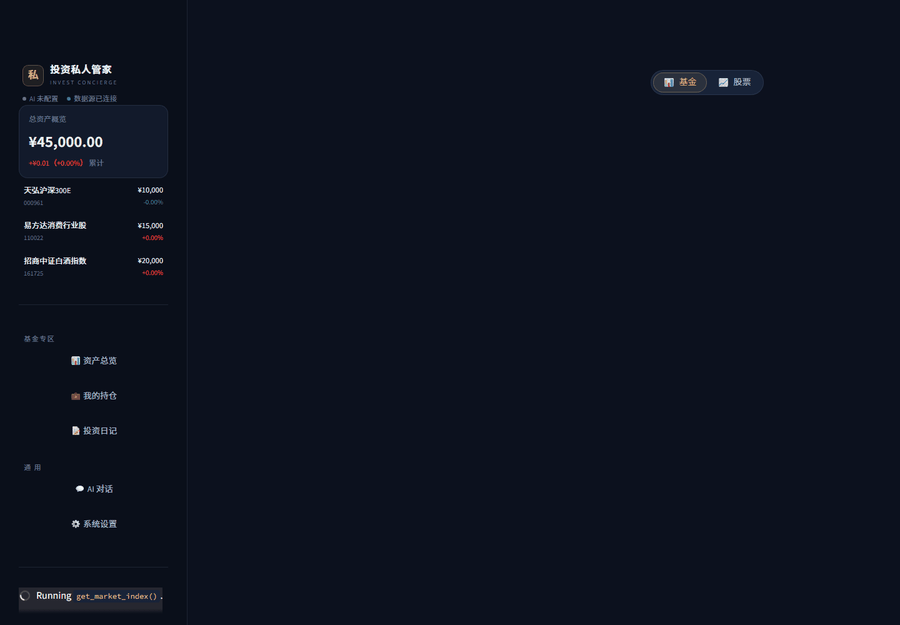
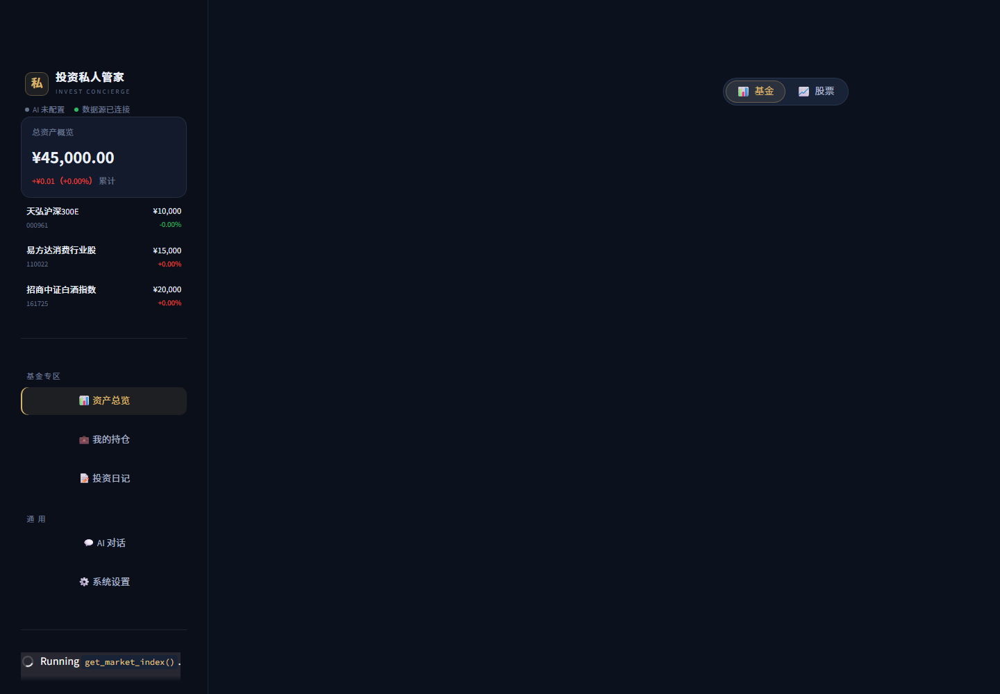
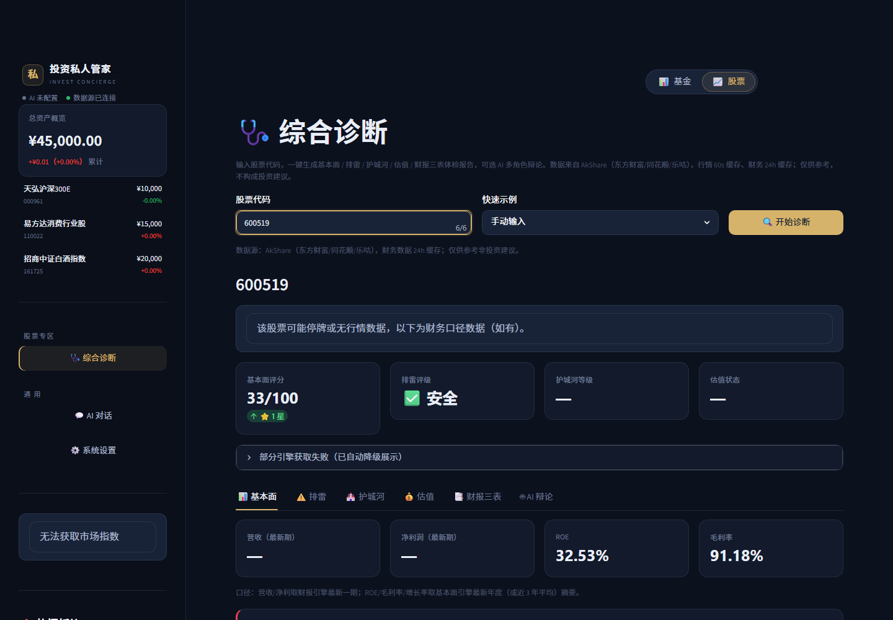
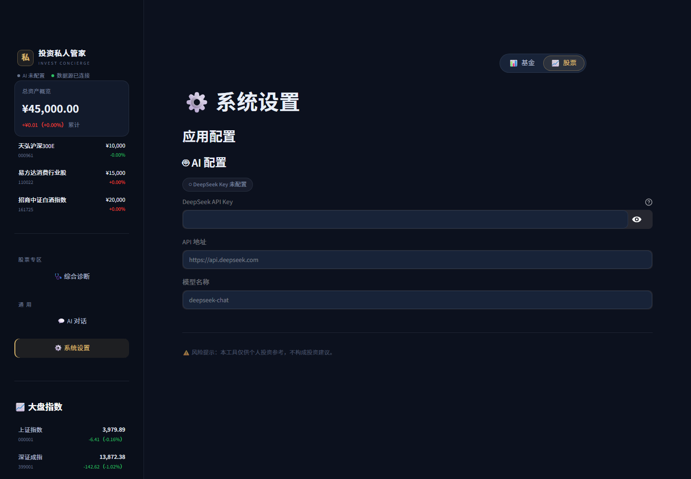
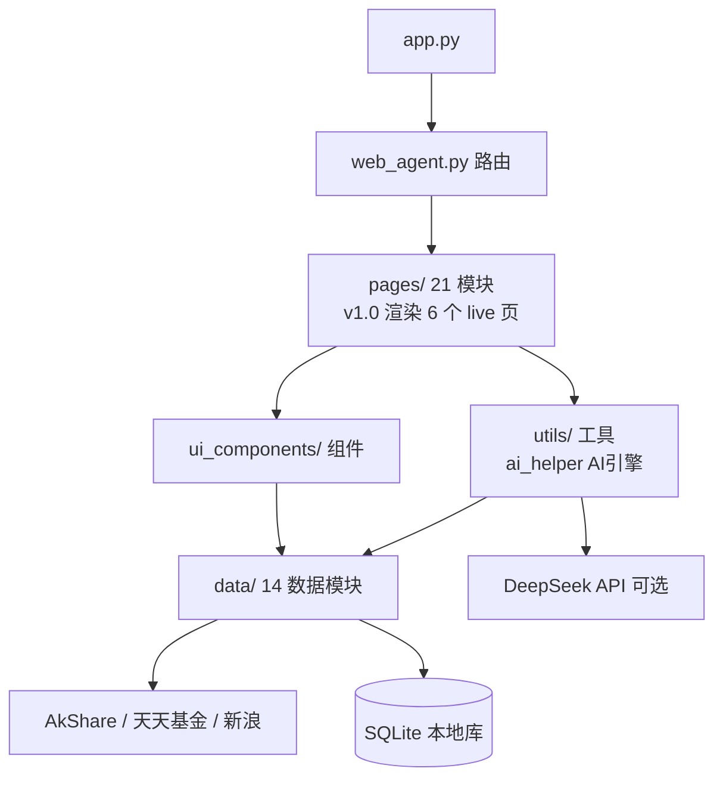

# 投资私人管家 · invest-concierge

[](https://github.com/cx-ssg/invest-concierge/actions/workflows/ci.yml)
[]()
[]()

> A股基金 AI 私人顾问 —— 开源 · 免费数据 · 打开即用
>
> **投资私人管家（Invest Concierge）**：把财报、估值、资金面翻译成普通人能看懂的话。

## ⚠️ 免责声明（请先阅读）

- 本项目仅供**学习与技术研究**，不构成任何投资建议或操作依据。
- 股市有风险，入市需谨慎；据此操作，风险自担。
- 项目数据来自公开免费接口（AkShare / 天天基金 / 新浪财经），可能存在延迟或错误，请以官方披露信息为准。

## 🖼️ 界面预览



| 基金持仓管理 | 股票综合诊断 | 双轨导航 |
|---|---|---|
|  |  |  |

## 这是什么

**投资私人管家**是一个基于 Streamlit 的开源 A股/基金分析助手：不依赖任何收费数据源，克隆下来就能跑。内置 AI 能力（可选接入 DeepSeek），把财报、估值、资金面翻译成普通人能看懂的话。

**双轨导航**：主界面右上角一键切换「📊 基金」/「📈 股票」两大专栏，侧边栏随轨变化，干净不杂乱。

## ✨ 当前功能

| 功能 | 说明 | 状态 |
|---|---|---|
| 💼 基金持仓管理 | 录入持仓，自动追踪收益与当日实时估值 | ✅ |
| 📊 资产总览 | 总资产与持仓收益一览 | ✅ |
| 📔 投资日记 | 记录每笔操作的理由，与未来的自己对话 | ✅ |
| 💬 AI 对话 | 接入 DeepSeek 的投资问答助手（含工具调用） | ✅ 可选¹ |
| 🩺 股票综合诊断 | 财报 / 排雷 / 护城河 / 估值 / 三表 多引擎体检 + AI 多角色辩论 | ✅ |

¹ AI 对话与 AI 辩论需要配置 DeepSeek API Key（[注册地址](https://platform.deepseek.com/)，有免费额度）；**不配置 Key 时其余功能完整可用**。

> 🚧 **开发中**：回测 / 定投 / 基金对比 / 涨停复盘等更多页面正在迭代（数据层函数已就绪，UI 接线中）；FastAPI 桥 + 前端重构同步推进（见 `docs/`）。

## 🚀 快速开始

环境要求：**Python 3.9+**（Windows 安装时建议勾选 Add Python to PATH）

```bash
git clone https://github.com/cx-ssg/invest-concierge.git
cd invest-concierge
pip install -r requirements.txt
```

配置 AI Key（可选）：复制 `local_env.bat.example` 为 `local_env.bat`，填入你的 DeepSeek API Key。

启动：

```bash
# Windows：双击 start.bat，或
python -m streamlit run app.py
```

浏览器会自动打开 http://localhost:8501 。

## 🏗️ 架构



**数据层**：`data/` 下 14 个模块覆盖基金/股票行情、财报、估值、资金流、情绪、涨停复盘、护城河、财务排雷等；统一走 `cache.py` 内存缓存 + fallback 降级。

**AI 引擎**：`utils/ai_helper.py` 支持工具调用（Tool Calling），多角色分析（基本面/技术/情绪/风控 → 决策委员会主席）产出带评级的辩论结论。

## 🧭 差异化

| | invest-concierge | 常见行情工具 |
|---|---|---|
| 数据源 | 全免费（AkShare 等） | 常需付费 Key |
| 上手 | 克隆即跑，零配置可用 | 需自己搭环境 |
| AI | 多角色辩论（非单问答） | 多为单轮问答 |
| 体检 | 排雷 8 区 + 护城河 6 维 + 估值 | 多为单指标展示 |

## 🤖 Built with AI

本项目通过多 Agent 协作开发（AI 辅助编程工作流）：规划拆解 → 模块化实现 → 测试先行 → 独立审计。涉及技能：TDD / 安全加固 / CI 门禁 / 文档蒸馏。

## 🧭 开发路线（Roadmap）

见 [docs/ROADMAP.md](docs/ROADMAP.md)（占位功能陆续点亮中，欢迎提 issue）。

## 📜 文档

- [架构详解](docs/ARCHITECTURE.md)
- [路线图](docs/ROADMAP.md)
- [贡献指南](docs/CONTRIBUTING.md)
- [诊断页验收记录](docs/verification.md)

## 📄 许可证

[MIT](LICENSE)

---

*数据仅供参考，不构成投资建议。市场有风险，投资需谨慎。*