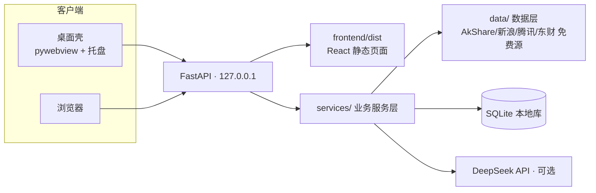

# invest-concierge · 投资私人管家

[](https://github.com/cx-ssg/invest-concierge/actions/workflows/ci.yml)
[]()
[]()

> A股/基金 AI 私人顾问 —— 开源 · 免费数据 · 桌面版 / 网页版双形态
>
> **投资私人管家（Invest Concierge）**：把财报、估值、资金面翻译成普通人能看懂的话。

## ⚠️ 免责声明（请先阅读）

- 本项目仅供**学习与技术研究**，不构成任何投资建议或操作依据。
- 股市有风险，入市需谨慎；据此操作，风险自担。
- 项目数据来自公开免费接口（AkShare / 天天基金 / 新浪财经等），可能存在延迟或错误，请以官方披露信息为准。

## ✨ 这是什么

一个开源的 **A股与基金分析助手**：不依赖任何收费数据源，克隆下来就能跑。内置 AI 能力（可选接入 DeepSeek），把财报、估值、资金面翻译成普通人能看懂的话。

当前已上线 6 个 live 页面（React 前端，桌面壳 / 浏览器双入口）：

| 页面 | 说明 |
|---|---|
| 💬 AI 对话（首页） | 投资问答助手：SSE 流式输出 + 模型原生思考流 + 工具调用时间线（11 个工具：行情/财报/持仓/日记…） |
| 📊 基金 · 资产总览 | 总资产与持仓收益一览 |
| 💼 基金 · 持仓管理 | 录入持仓，自动追踪收益与当日实时估值 |
| 📔 基金 · 投资日记 | 记录每笔操作的理由，与未来的自己对话 |
| 🩺 股票 · 综合诊断 | 基本面 / 排雷 / 护城河 / 估值 / 财报三表 / AI 辩论 六引擎体检 |
| ⚙️ 设置 | API Key 状态 / 应用信息 |

> 🚧 **开发中**：回测 / 定投 / 基金对比 / 涨停复盘等更多页面在路线图中迭代（见 [docs/ROADMAP.md](docs/ROADMAP.md)，欢迎提 issue）。

## 🚀 快速开始（三种方式，任选其一）

环境要求：**Python 3.9+**（Windows 安装时勾选 *Add Python to PATH*）。

### 方式一：普通用户 —— 桌面版（推荐，双击即用）

```bash
# 1. 安装依赖（只需一次）
pip install -r requirements.txt
```

```text
# 2. 双击 desktop\start.bat
```

启动后会自动完成：内嵌 FastAPI 后端（127.0.0.1:8000，被占用时自动换空闲端口）→ 打开原生桌面窗口（pywebview 渲染前端）→ 关窗最小化到系统托盘，托盘「退出」结束程序。

- 桌面上不了/没图形环境也别慌：`desktop\launcher.py` 会自动回退为**浏览器模式**，功能零损失。
- 预打包 exe 将随 GitHub Releases 提供（当前请用方式一/二）。

### 方式二：开发者 —— 源码直接跑

```bash
git clone https://github.com/cx-ssg/invest-concierge.git
cd invest-concierge
pip install -r requirements.txt

# 构建前端（生产模式产物 frontend/dist；构建用相对 /api，任意端口同源可用）
cd frontend
npm install
npm run build
cd ..

# 桌面版（等价于 start.bat）
python desktop\launcher.py

# 或纯浏览器模式（不起 GUI）
python desktop\launcher.py --browser
```

前端开发（热更新）：

```bash
# 终端 1：起 Vite dev server
cd frontend && npm run dev

# 终端 2：桌面壳指向 dev server
python desktop\launcher.py --mode dev
```

### 方式三：纯网页模式

```bash
# 前提：已执行过 npm run build（frontend/dist 存在）
uvicorn server.main:app --host 127.0.0.1 --port 8000
```

浏览器打开 **http://127.0.0.1:8000** 即可。

## 🔑 配置 DeepSeek API Key（可选）

AI 对话与诊断 AI 辩论需要 Key；**不配置时其余功能完整可用**（无 Key 会在页面显示引导卡，不会报错）。

1. 到 [DeepSeek 开放平台](https://platform.deepseek.com/) 注册并创建 API Key（有免费额度）。
2. **复制 `.env.example` 为根目录 `.env`，填入你的 Key：**

```bash
# Windows PowerShell
Copy-Item .env.example .env
# 然后编辑 .env，把 DEEPSEEK_API_KEY= 后面填上你的 Key
```

```text
DEEPSEEK_API_KEY=sk-xxxxxxxxxxxxxxxx
```

> ✅ `.env` 已被 `.gitignore` 忽略，真实 Key **不会**被提交到仓库；`.env.example` 只是不含密钥的模板。
> 💡 也可以不建 `.env`，直接设置系统环境变量 `DEEPSEEK_API_KEY`（系统变量优先级更高）。

## 🏗️ 架构



- **前端**：React 19 单页应用（三区壳：标题栏 / 侧边栏 / 状态栏），通过 HTTP + SSE 与后端通信。
- **后端**：FastAPI 提供 REST（持仓/日记/诊断/设置）+ SSE（AI 对话流式事件：`status → reasoning → tool_start/tool_end → done`）。
- **数据层**：`data/` 模块统一走缓存 + fallback 降级（弱网自动切备用源，失败显示「--」不崩溃）。
- **Agent 引擎**：`utils/agent_core.py` 工具注册表（晚绑定 importlib）+ 8 轮规划循环，`utils/agent_memory.py` 会话摘要注入。

## 📁 目录结构

```text
invest-concierge/
├─ server/            FastAPI 路由 + frontend/dist 静态托管（入口：server.main:app）
├─ services/          业务服务层（agent / diagnosis / holdings / diary / settings / status）
├─ frontend/          React 19 前端（Vite + TypeScript + Tailwind v4）→ 构建产物 dist/
├─ desktop/           桌面壳（launcher.py 主入口 / backend.py 内嵌 uvicorn / tray.py 托盘 / start.bat）
├─ data/              数据层（AkShare 等免费数据源 + SQLite 持久化 + 缓存/降级）
├─ utils/             AI 引擎与 Agent（ai_helper / agent_core 工具注册表 / agent_memory）
├─ pages/             旧 Streamlit 页面（保留备查，不参与新 UI；入口 app.py）
├─ tests/             110 个 pytest 用例（含 M0 桥 / 工具注册表 / 记忆 / 排雷 / 估值）
├─ assets/            设计素材（mockups）
├─ .env.example       环境变量模板（复制为 .env 使用）
├─ requirements.txt   Python 依赖
└─ docs/              文档（架构 / 路线图 / 贡献指南 / 验收记录）
```

## 🧰 技术栈

| 层 | 技术 |
|---|---|
| 后端 | FastAPI + uvicorn + pydantic（REST + SSE 流式） |
| 前端 | React 19 + Vite 8 + TypeScript + Tailwind CSS v4 |
| 桌面 | pywebview（WebView2）+ pystray 托盘 + Pillow |
| 数据 | AkShare（免费行情/财报/估值）+ SQLite + pandas / numpy |
| AI | DeepSeek API（OpenAI 兼容 SDK；工具调用 + 推理思考流） |

## ⚠️ 已知限制

- **免费数据源波动**：行情/财报来自免费公开接口，网络弱或被限速时自动 fallback（如腾讯/新浪/百度），数据可能延迟或缺失；akshare 接口随版本变动，页面一律降级显示「--」，不会崩溃。
- **桌面壳平台**：依赖 Edge WebView2 Runtime（Win10/11 一般自带）；无图形环境或缺少 pywebview 时自动回退浏览器模式。Linux/macOS 建议直接使用**网页模式**。
- **AI 依赖网络与 Key**：未配置 DeepSeek Key 时 AI 功能展示引导卡；弱网下 AI 流式对话可能超时。
- **当前 live 页面 6 个**：其余规划页（回测/定投/基金对比等）数据层函数已就绪，见 [docs/ROADMAP.md](docs/ROADMAP.md)。

## 🧭 差异化

| | invest-concierge | 常见行情工具 |
|---|---|---|
| 数据源 | 全免费（AkShare 等） | 常需付费 Key |
| 上手 | 克隆即跑，零配置可用 | 需自己搭环境 |
| AI | 多角色辩论 + 工具调用 + 思考流（非单问答） | 多为单轮问答 |
| 体检 | 排雷 + 护城河 6 维 + 估值分位 + 三表 | 多为单指标展示 |

## 🧪 测试与质量

- 后端：`pytest tests/`（110 用例，全部通过）
- 前端：`cd frontend && npm run build`（tsc 类型检查 + vite 构建）
- 桌面壳：`python desktop\smoke_test.py`（依赖 / dist 产物 / 端口策略 / 内嵌后端 / GUI·托盘冒烟）
- CI：GitHub Actions 双矩阵（Python 3.9 / 3.11）+ gitleaks 密钥扫描

## 🤖 Built with AI

本项目通过多 Agent 协作开发（AI 辅助编程工作流）：规划拆解 → 模块化实现 → 测试先行 → 独立审计。

## 📜 文档

- [架构详解](docs/ARCHITECTURE.md)
- [路线图](docs/ROADMAP.md)
- [贡献指南](docs/CONTRIBUTING.md)
- [诊断页验收记录](docs/verification.md)

## 📄 许可证

[MIT](LICENSE)

---

*数据仅供参考，不构成投资建议。市场有风险，投资需谨慎。*