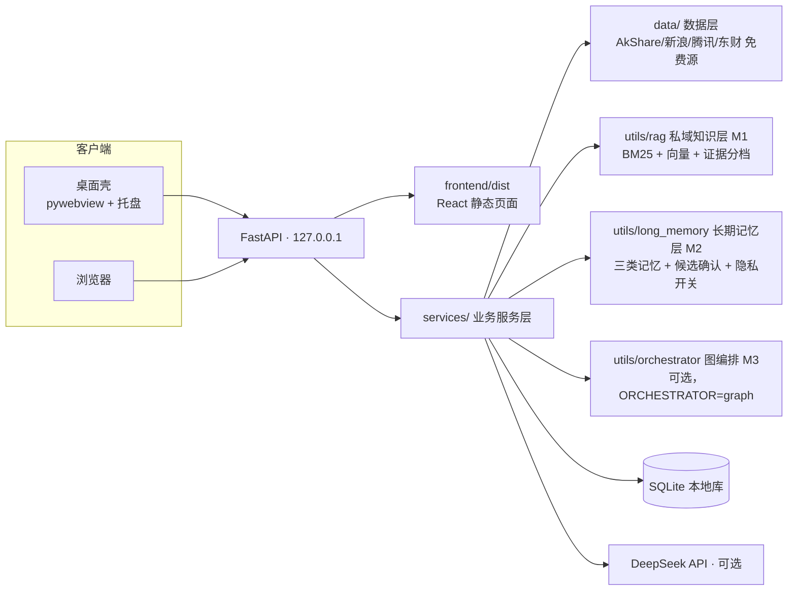

# invest-concierge · 投资私人管家

[](https://github.com/cx-ssg/invest-concierge/actions/workflows/ci.yml)
[]()
[]()

> A股/基金 AI 私人顾问 —— 开源 · 免费数据 · 桌面版 / 网页版双形态
>
> **投资私人管家（Invest Concierge）**：把财报、估值、资金面翻译成普通人能看懂的话。

## 🖼️ 界面预览


*↑ 37 秒演示（GIF 1.1 MB / 也有 [MP4](assets/demo/invest-concierge-demo.mp4) 版）：**由实机截图合成的页面巡览（非屏幕录制）**，含一次真实的 AI 问答。*

| AI 对话（真实问答 · 工具时间线 + 诚实标注数据缺口） | 股票 · 综合诊断 |
|:---:|:---:|
|  |  |

| 市场行情 · 五 tab（真实指数数据） | 基金 · 投资日记 |
|:---:|:---:|
|  |  |

| 股票 · 自选股 | 价格预警 |
|:---:|:---:|
|  |  |

| 基金 · 持仓管理 | 系统设置（模型接入 / 隐私 / 长期记忆） |
|:---:|:---:|
|  |  |

*浅色 / 暗色双主题，右上角一键切换。截图取自 **2026-10-04 实机运行（v1.5.0）**，行情为当日真实数据。*

## ⚠️ 免责声明（请先阅读）

- 本项目仅供**学习与技术研究**，不构成任何投资建议或操作依据。
- 股市有风险，入市需谨慎；据此操作，风险自担。
- 项目数据来自公开免费接口（AkShare / 天天基金 / 新浪财经等），可能存在延迟或错误，请以官方披露信息为准。

## ✨ 这是什么

一个开源的 **A股与基金分析助手**：不依赖任何收费数据源，克隆下来就能跑。内置 AI 能力（可选接入 DeepSeek），把财报、估值、资金面翻译成普通人能看懂的话。

当前已上线 9 个 live 页面（React 前端，桌面壳 / 浏览器双入口）：

| 页面 | 说明 |
|---|---|
| 💬 AI 对话（首页） | 投资问答助手：SSE 流式输出 + 模型原生思考流 + 工具调用时间线（**31 个工具**：行情/财报/估值/资金流/搜索/回测/文档检索/龙虎打板…） |
| 📊 基金 · 资产总览 | 总资产与持仓收益一览（含一键生成持仓周报） |
| 💼 基金 · 持仓管理 | 录入持仓，自动追踪收益与当日实时估值 |
| 📔 基金 · 投资日记 | 记录每笔操作的理由，与未来的自己对话 |
| 📉 基金 · 市场行情 | 指数 / 板块 / 情绪 / 资金 / 估值 五 tab 速览（真实行情，取不到就如实显示「不可得」） |
| 🩺 股票 · 综合诊断 | 基本面 / 排雷 / 护城河 / 估值 / 财报三表 / AI 辩论 六引擎体检 |
| ⭐ 股票 · 自选股 | 自选股 / 持仓股票两个 tab：搜索加入、实时行情、市值与浮动盈亏 |
| 🔔 价格预警 | 到价提醒：规则增删 + 触发事件时间线（判定在后端低频调度器，桌面壳走托盘气泡） |
| ⚙️ 设置 | API Key 状态 / 应用信息 / 长期记忆管理（M2） |

> 🚧 **开发中**：回测 / 定投 / 基金对比 / 涨停复盘等能力**工具层已就绪**（AI 对话可直接调用），对应独立页面仍在路线图中迭代（见 [docs/ROADMAP.md](docs/ROADMAP.md)，欢迎提 issue）。

**能力分层（M1 / M2 / M3 都已随源码提供）**：

| 层 | 一句话 | 入口 |
|---|---|---|
| **M1 · 私域知识层** | 本地公告 / 研报语料 → BM25 + `bge-m3` 向量混合检索（RRF 融合），返回原文片段 + 来源 + 日期 | 工具 `retrieve_docs`（31 个 Agent 工具之一） |
| **M2 · 长期记忆层** | 三类记忆分离存储、分离召回（偏好**每次对话必注入** / 事实**按标的** / 经验**向量 top-3**）；写入走「候选 → 用户确认」，**AI 不自行写记忆** | 设置页「长期记忆」区（列表 / 删除 / 候选确认 / **召回预览**） |
| **M3 · 图编排（可选）** | `ORCHESTRATOR=graph` 才开启，**默认 `legacy`、行为不变**；只图化「股票深度诊断」一条链路，换来检查点续跑与人工确认 | `POST /api/stocks/{code}/diagnosis/review` + SQLite 检查点 |

**v1.3.0 → v1.3.2 新增（当前能力，详细口径见后续章节与 [docs/RELEASE_NOTES_v1.3.2.md](docs/RELEASE_NOTES_v1.3.2.md)）**：

| 能力 | 说明 |
|---|---|
| **引用回跳** | 检索类回答正文里的 `[n]` 是**可点上标**，下方来源卡给出**标题 / 日期 / 链接** |
| **LLM 判官（A3b）** | **异步**（`done` 先到、`evidence_judged` 后到）· **仅 weak 档触发**（`none` 档已弃权、判官零调用）· 判官引文需**逐字**命中原文块（确定性校验）· **失败一律降级** `uncertain`；来源卡按判官结论标注 |
| **历史回放显示来源** | 切回**旧会话**也能看到来源卡与判官标注（v1.3.1 起，落 `agent_messages.meta`）；**老会话不回填**（`meta = NULL` ⇒ 不显示来源区） |
| **M2 长期记忆层 + 前端记忆管理 UI** | 三类记忆**分离存储、分离召回**；写入走「候选 → 用户确认」（**AI 不自行写记忆**）；设置页可列表 / 删除 / 确认候选 / **召回预览**（详见下方 M2 章节） |
| **多标的语料 + 查询侧标的识别** | 自建语料 **65 docs / 2111 chunks**（茅台 + 五粮液 + 泸州老窖 + 山西汾酒）；新增 `query_scope` 识别到标的才收窄检索池，抑制**跨标的污染**（口径见评测小节） |

## 🚀 快速开始（四种方式，任选其一）

### 方式一：下载安装包（推荐，零 Python 环境）

> ⚠️ **版本与下载口径（务必先读）**：仓库最新 tag 与**最新 GitHub Release 均为 `v1.3.2`**
> （`Releases/latest` 指向它，2026-10-04 发布）。
> **但最新 Release 不一定带安装包**：`v1.1.0` / `v1.2.0` / `v1.3.0` 发布说明都写明「本次未重新打包安装器」，
> `v1.3.1` / `v1.3.2` 为 patch 版、发布说明未提及资产变更 ⇒ **请按 `Releases/latest` 页面实际列出的资产下载**；
> 若该页没有 exe，安装包请到
> [v1.0.0 Release](https://github.com/cx-ssg/invest-concierge/releases/tag/v1.0.0) 下载
> （`v1.1.0` / `v1.2.0` / `v1.3.0` 发布说明均记载安装包落在该页）。
> **安装包里的 exe 对应 v1.0.0 的代码；M1 / M2 / M3 等新能力是源码功能，不要把安装包当成最新代码。**
> 想用新功能请按下面「方式二」源码运行，或按 `docs/PACKAGING.md` 自行构建安装包。

到 [Releases](https://github.com/cx-ssg/invest-concierge/releases/latest) 下载：

- **`invest-concierge-setup-v*.exe`** —— 安装器，双击安装（用户级，无需管理员），开始菜单/桌面生成快捷方式
- **`invest-concierge.exe`** —— 绿色单文件，双击即用

启动后进入设置页填入 DeepSeek API Key（[免费注册领取](https://platform.deepseek.com/)）即可使用 AI 功能；不填 Key 也能看行情、记持仓、写日记（AI 对话会友好引导）。

> exe 未做代码签名，首次运行如遇 SmartScreen 提示，点"更多信息 → 仍要运行"。
> 需要 Edge WebView2 Runtime（Win10/11 一般自带）；无图形环境自动回退浏览器模式，功能零损失。

### 方式二：源码运行（已装 Python）

环境要求：**Python 3.9+**（Windows 安装时勾选 *Add Python to PATH*）。

```bash
# 1. 安装依赖（只需一次）
pip install -r requirements.txt
```

```text
# 2. 双击 desktop\start.bat
```

启动后会自动完成：内嵌 FastAPI 后端（127.0.0.1:8000，被占用时自动换空闲端口）→ 打开原生桌面窗口（pywebview 渲染前端）→ 关窗最小化到系统托盘，托盘「退出」结束程序。

- 桌面上不了/没图形环境也别慌：`desktop\launcher.py` 会自动回退为**浏览器模式**，功能零损失。

### 方式三：开发者 —— 源码直接跑

```bash
git clone https://github.com/cx-ssg/invest-concierge.git
cd invest-concierge
pip install -r requirements.txt

# 构建前端（生产模式产物 frontend/dist；构建用相对 /api，任意端口同源可用）
cd frontend
npm install
npm run build
cd ..

# 桌面版（等价于 start.bat）
python desktop\launcher.py

# 或纯浏览器模式（不起 GUI）
python desktop\launcher.py --browser
```

前端开发（热更新）：

```bash
# 终端 1：起 Vite dev server
cd frontend && npm run dev

# 终端 2：桌面壳指向 dev server
python desktop\launcher.py --mode dev
```

### 方式四：纯网页模式

```bash
# 前提：已执行过 npm run build（frontend/dist 存在）
uvicorn server.main:app --host 127.0.0.1 --port 8000
```

浏览器打开 **http://127.0.0.1:8000** 即可。

## 🔑 配置 DeepSeek API Key（可选）

AI 对话与诊断 AI 辩论需要 Key；**不配置时其余功能完整可用**（无 Key 会在页面显示引导卡，不会报错）。

1. 到 [DeepSeek 开放平台](https://platform.deepseek.com/) 注册并创建 API Key（有免费额度）。
2. **复制 `.env.example` 为根目录 `.env`，填入你的 Key：**

```bash
# Windows PowerShell
Copy-Item .env.example .env
# 然后编辑 .env，把 DEEPSEEK_API_KEY= 后面填上你的 Key
```

```text
DEEPSEEK_API_KEY=sk-xxxxxxxxxxxxxxxx
```

> ✅ `.env` 已被 `.gitignore` 忽略，真实 Key **不会**被提交到仓库；`.env.example` 只是不含密钥的模板。
> 💡 也可以不建 `.env`，直接设置系统环境变量 `DEEPSEEK_API_KEY`（系统变量优先级更高）。

## 🏗️ 架构


```mermaid
flowchart LR
    subgraph 客户端
      A[桌面壳<br/>pywebview + 托盘]
      B[浏览器]
    end
    A --> C[FastAPI · 127.0.0.1]
    B --> C
    C --> H[frontend/dist<br/>React 静态页面]
    C --> D[services/ 业务服务层]
    D --> E[data/ 数据层<br/>AkShare/新浪/腾讯/东财 免费源]
    D --> R[utils/rag 私域知识层 M1<br/>BM25 + 向量 + 证据分档]
    D --> M[utils/long_memory 长期记忆层 M2<br/>三类记忆 + 候选确认 + 隐私开关]
    D --> O[utils/orchestrator 图编排 M3<br/>可选，ORCHESTRATOR=graph]
    D --> F[(SQLite 本地库)]
    D --> G[DeepSeek API · 可选]
```

- **前端**：React 19 单页应用（三区壳：标题栏 / 侧边栏 / 状态栏），通过 HTTP + SSE 与后端通信。
- **后端**：FastAPI 提供 REST（持仓/日记/诊断/设置/记忆/预警/行情/自选）+ SSE（AI 对话流式事件：`status → reasoning → tool_start/tool_end → done`）。
- **数据层**：`data/` 模块统一走缓存 + fallback 降级（弱网自动切备用源，失败显示「--」不崩溃）。
- **Agent 引擎**：`utils/agent_core.py` 工具注册表（**31 个工具**，晚绑定 importlib）+ 8 轮规划循环，`utils/agent_memory.py` 会话摘要注入。
- **知识层（M1）**：`utils/rag/` 私域文档检索（切块 / `bge-m3` 向量 + BM25 → **RRF 融合** / 两档证据判定），采集与评测脚本在 `scripts/rag_*.py`。
- **长期记忆层（M2）**：`utils/long_memory.py` —— 三类记忆**分离存储、分离召回**；**AI 不自行写记忆**（隐式抽取 → 候选 → 用户确认）；注入走 `agent_run` 的 `## 长期记忆` 段 + `memory_used` 事件；设置页有**召回预览**审计入口与隐私开关。详见 [长期记忆层（M2）](#-长期记忆层m2)。
- **编排层（M3，可选）**：`utils/orchestrator/` —— `ORCHESTRATOR=graph` 才生效，**默认 `legacy` 行为不变**；只图化「股票深度诊断」一条链路。详见 [可选：图编排模式](#-可选图编排模式experimental)。

## 📁 目录结构

```text
invest-concierge/
├─ server/            FastAPI 路由 + frontend/dist 静态托管（入口：server.main:app）
├─ services/          业务服务层（agent / diagnosis / holdings / diary / settings / status）
├─ frontend/          React 19 前端（Vite + TypeScript + Tailwind v4）→ 构建产物 dist/
├─ desktop/           桌面壳（launcher.py 主入口 / backend.py 内嵌 uvicorn / tray.py 托盘 / start.bat）
├─ data/              数据层（AkShare 等免费数据源 + SQLite 持久化 + 缓存/降级）
├─ utils/             AI 引擎与 Agent（ai_helper / agent_core 工具注册表 / agent_memory）
├─ utils/rag/         私域知识层 M1（chunker / embed / bm25 / hybrid / evidence / retrieve / store）
├─ utils/long_memory.py  长期记忆层 M2（三类记忆 / 候选确认 / 召回预览 / 隐私开关）
├─ utils/orchestrator/   图编排 M3（flags / state / graph / nodes / adapters）
├─ scripts/           采集与评测脚本（rag_ingest*.py / rag_eval.py / rag_rerank_probe.py）
├─ pages/             旧 Streamlit 页面（保留备查，不参与新 UI；入口 app.py）
├─ tests/             **676 个 pytest 用例**（2026-10-04 H7 实测全绿；工具契约 / 排雷与估值 / 记忆 / RAG / 图编排 / 采集与切块 / 并发名额 / 行情与自选 / 龙虎打板工具族 / 版本口径六面锁）
├─ assets/            设计素材（mockups）
├─ .env.example       环境变量模板（复制为 .env 使用）
├─ requirements.txt   Python 依赖
└─ docs/              文档（架构 / 路线图 / 贡献指南 / 验收记录）
```

## 🧰 技术栈

| 层 | 技术 |
|---|---|
| 后端 | FastAPI + uvicorn + pydantic（REST + SSE 流式） |
| 前端 | React 19 + Vite 8 + TypeScript + Tailwind CSS v4 |
| 桌面 | pywebview（WebView2）+ pystray 托盘 + Pillow |
| 数据 | AkShare（免费行情/财报/估值）+ SQLite + pandas / numpy |
| AI | DeepSeek API（OpenAI 兼容 SDK；工具调用 + 推理思考流） |
| 编排（可选） | LangGraph + `langgraph-checkpoint-sqlite`（`ORCHESTRATOR=graph`） |

## ⚠️ 已知限制

- **免费数据源波动**：行情/财报来自免费公开接口，网络弱或被限速时自动 fallback（如腾讯/新浪/百度），数据可能延迟或缺失；akshare 接口随版本变动，页面一律降级显示「--」，不会崩溃。
- **桌面壳平台**：依赖 Edge WebView2 Runtime（Win10/11 一般自带）；无图形环境或缺少 pywebview 时自动回退浏览器模式。Linux/macOS 建议直接使用**网页模式**。
- **AI 依赖网络与 Key**：未配置 DeepSeek Key 时 AI 功能展示引导卡；弱网下 AI 流式对话可能超时。
- **知识库需自行构建**：语料库与向量（`*.db` / `corpus/`）不随仓库分发，需跑 `scripts/rag_ingest*.py`；未构建时文档检索会如实告知「未找到」。
- **本地向量模型**：默认走本地 Ollama `bge-m3`；未安装 Ollama 时可改用 OpenAI 兼容端点。
- **长期记忆不入仓**：M2 的记忆存在本机 SQLite（`memories` / `memories_pending` 两表），仓库不带任何历史记忆；经验记忆的向量召回依赖本地 Ollama `bge-m3`，未安装时降级为按时间倒序，并在注入文本里如实标注「未向量化，按时间序」（不报错、也不假装记得）。
- **图编排是 experimental**：仅 `ORCHESTRATOR=graph` 时生效，**只图化「股票深度诊断」一条链路**，其余 30 个工具仍走原线性循环；M2 未接进图（两者独立）。
- **当前 live 页面 9 个**：其余规划页（回测/定投/基金对比等）数据层函数已就绪，见 [docs/ROADMAP.md](docs/ROADMAP.md)。

## 🔍 私域知识层（带引用的文档检索）

除了实时行情，项目内置**本地文档检索**：把上市公司公告 / 研报 / 财报原文按语义切块、向量化入库，
回答时**返回原文片段 + 来源 + 日期**，而不是让模型凭空作答。

| | 说明 |
|---|---|
| 工具 | `retrieve_docs`（**31 个 Agent 工具之一**，AI 对话里直接问「某公司某期经营现金流多少」） |
| 存储 | 本地 SQLite（`kb.db`）+ `bge-m3` 向量（1024 维，走本地 Ollama，可降级到 OpenAI 兼容端点） |
| 检索 | 混合检索：BM25 + 向量 → **RRF 融合**，支持同文档限额 |
| **证据分档（两档）** | 判据不通过 ⇒ `none` 档**主动弃权**；其余一律 `weak` 档 —— **返回结果但必带**「证据不足档（证据不足）—— 引用前请自行核验」警示。原有的 `strong` 档已于 2026-09-18 撤下 ⇒ **不存在"跳过警示"的通道** |
| **查询侧标的识别（v1.3.1）** | `utils/rag/query_scope.py` —— 识别到标的才**收窄检索池**（抑制跨标的污染），**识别不到时保持全库**（跨标的/行业类查询不受影响）；返回体新增 `scope` 字段（`explicit` / `auto` / `full`） |
| **LLM 判官（A3b，v1.3.0 起）** | **仅 `weak` 档触发**（`none` 档已弃权 ⇒ 零调用）；**异步**（`done` 先到、`evidence_judged` 后到）；引文需**逐字**命中原文块；**失败一律降级** `uncertain`。判据与门槛见下方评测小节 |
| **引用回跳（v1.3.0 起）** | 回答正文 `[n]` 为**可点上标** + 来源卡（标题 / 日期 / 链接）；**切回历史会话同样显示**（v1.3.1 起，落 `agent_messages.meta`；老会话不回填） |
| 采集 | 巨潮资讯公告 API / **PDF 全文抽取**（`pypdf`）→ 切块 → 向量化，全程脚本可复现 |

**为什么强调引用与弃权**：投资领域最怕「听起来很确定的胡说」。
这里的取舍是 —— **宁可回答「没找到」，也不编一段**。

### 首次使用（知识库不入库，需自行构建）

语料库与向量（`*.db` / `corpus/`）**不随仓库分发**（体积与版权原因），首次使用请：

```bash
# 1. 确保本地 Ollama 已就绪并拉取向量模型
ollama pull bge-m3

# 2. 采集 + 入库（示例：拉取一只股票的公告）
python scripts/rag_ingest.py --code 600519

# 3. 大文档（半年报/年报全文）走巨潮 PDF
python scripts/rag_ingest_pdf.py --code 600519
```

### 评测（可复现）

评测集随仓库分发（`tests/golden/rag/`），可自行复跑：

```bash
python scripts/rag_eval.py --split holdout               # 指标总览（`prod` / `full` 两种口径并列打印）
python scripts/rag_eval.py --split holdout --judge llm   # 判官判据（会调模型）
python scripts/rag_eval.py --split tuning --scan         # 阈值敏感性扫描
python scripts/rag_rerank_probe.py --split holdout       # LLM 重排探针（离线，会调模型）
```

**检索（holdout，n = 27 条正例；语料 65 docs / 2111 chunks）—— 两种口径必须并列读**：

| 口径 | 含义 | `Recall@5` | `MRR@10` |
|---|---|---|---|
| `prod` | **已知标的**时（query 含**由金标派生**的标的） | **0.926** | **0.781** |
| `full` | **无法识别标的**时（全库检索） | **0.593** | **0.386** |

> ⚠️ **`prod` 是 oracle 上界，不是产线实测** —— 该口径的 query 含**由金标派生的标的**信息，代表「已知标的时」的能力**上限**；
> `full` 代表「**无法识别标的**时」的真实能力（**刻意保留**，不是「没修好」）。
> **`query_scope`（查询侧标的识别）的真实净贡献 = `Recall@5` 0.889 → 0.926**（混标的 7/27 → 0/27；
> **不是** 0.593 → 0.926，后者含「查询形态效应」）。

**A3a（域外主动弃权）**：**0.863** —— ⚠️ **必须带限定**：该值经 **holdout 二次标定**（阈值由 holdout 派生夹具臂重定标），
**不能称「holdout 验收」**；敏感性区间 **[0.863, 0.902]**（0.902 实测可达，但需**第三次动用 holdout** ⇒ **主动不取**，宁可报保守值）。

**A3b · LLM 判官判据**（holdout，5 次采样）：

| 判据 | 门槛 | 实测 | 结论 |
|---|---|---|---|
| `judge_fp` | ≤0.10 | **0.097** | ✅ 达标 |
| `judge_fn` | **≤0.20**（**2026-10-03 由 0.15 订正**，依据见 `docs/M1_EVAL_REPORT.md`「判据门槛修订说明」） | **0.192** | ✅ 按新门槛 |
| `span_valid` | ≥0.95 | **0.955** [0.955, 0.979] | ✅ 达标（**区间不跨阈值**；v1.3.1 时为 0.951、区间跨阈值） |

> ⚠️ **门槛订正不是放宽安全性**：`judge_fp ≤0.10` 与 `span_valid ≥0.95` **未变**，只调整「判官侧覆盖度」（`judge_fn`）——
> 依据是「`judge_fn ≤0.15` 与『判官只看前 5 条候选』（`JUDGE_MAX_CANDIDATES = 5`）**算术上不兼容**」
> （判官侧修满的地板 = 4/26 = **0.1538 > 0.15**）。
> ⚠️ `judge_fn` 中「判官自身」的份额是**上界口径**（gold 落在候选窗内才计入分母）。

⚠️ **评测集性质（重要披露）**：holdout 的**负例**是干净验收组（`v2`，由 `assert_clean_holdout()` 强制），
而**正例 27 条 = 21 条 `v1`（阈值调参时已看过）+ 6 条 `v2`**，且 `max_per_doc=2` 本身就是 holdout 上的扫描值
⇒ **上述检索指标含拟合成分，不应作为泛化承诺**（`rag_eval.py` 运行时会打印「holdout 已用于阈值选择（拟合集）」）。
复现命令与口径订正见 [docs/RELEASE_NOTES_v1.3.1.md](docs/RELEASE_NOTES_v1.3.1.md)；
**未达标项与已知边界同样记录在案**，见 [docs/M1_EVAL_REPORT.md](docs/M1_EVAL_REPORT.md) 与
[docs/COVERAGE_DESIGN.md](docs/COVERAGE_DESIGN.md)。

> 📌 **历史状态（勿与上表混读）**：基线（旧语料 75 块、无限额）`1.000 / 0.702` → 切 PDF 全文（268 块）`0.857 / 0.593`
> → +同文档限额 `0.952 / 0.605` —— 那是 **n=21 的旧口径**；**`0.952` / `0.605` 已不是当前指标**，不得当「当前指标」引用。

**LLM 重排探针（仍未接入产线）**：`MRR@10 = 0.706 ~ 0.738` 是**离线探针**（`scripts/rag_rerank_probe.py`）在**早期语料状态**下的结果，
**没有接进产线**（`git grep -i rerank -- utils/ services/ frontend/src` 零命中）；重排不改变结果集合 ⇒ `Recall@5` 不变。
要上线须先解决每题 +k 次模型调用的延迟与成本。

> ⚠️ **诚实边界**：内置能力用于打通链路与评测，语料需按自己的标的自行构建；
> 文档检索只负责「**找得到、可核对**」，**不构成投资建议**。

## 🧠 长期记忆层（M2）

M1 管的是「**文档里写了什么**」，M2 管的是「**你是谁、你做过什么**」—— 用户决策史与文档语料**分开存储**
（`memories` 表 vs `kb.db`，不混库），避免互相污染召回。

| | 说明 |
|---|---|
| 三类记忆（分离存储、分离召回） | `preference` 偏好 —— **每次对话必注入**（小、固定）／`fact` 事实 —— **按当前问题涉及的标的召回**／`experience` 经验 —— **向量召回 top-3**（无向量时按时间倒序并如实标注） |
| **AI 不自行写记忆** | 隐式抽取先落 `memories_pending` 候选，**用户逐条确认**才进正式表；对话里的显式「记住…」与设置页手动新增同样可追溯 |
| 可审计 / 可删除 | 设置页「长期记忆」区：三类分组列表 + 单条删除 + 候选确认 + 手动新增；**删除后 AI 立刻看不到** |
| **召回预览（审计入口）** | 设置页可模拟一次提问，直接看到「如果现在提问，AI 会看到哪些记忆」的**原文** —— 所见即真实注入内容 |
| 隐私开关 | 「允许 AI 使用长期记忆」默认**开**；关闭后**不注入、不发事件、不暗示记得** |
| 注入契约 | 命中才注入 `## 长期记忆` 段，并发 SSE `memory_used` 事件（`sources` 细分为 `preferences` / `facts` / `experiences`）；**无命中不发事件**（不假装记得） |
| 存储 | 本机 SQLite 两表（去重键 `UNIQUE(kind, key)`；经验按内容指纹去重）；**不入仓、不上传** |

API 入口（供自建脚本 / UI 调用）：`GET/POST /api/memory`、`DELETE /api/memory/{id}`、`GET/POST /api/memory/pending`、
`POST /api/memory/pending/{id}`、`POST /api/memory/summarize`、`GET/POST /api/memory/settings`、`GET /api/memory/recall-preview`。

> ⚠️ **诚实边界**：记忆由**你自己积累**（仓库不带历史记忆）；经验向量召回依赖本地 Ollama `bge-m3`，
> 未安装时降级为时间倒序 + 「未向量化」标注。
> 本机实测（2026-10-02，隔离库 + 真实 Ollama）：`embed_text` 返回 **4096 字节**（1024 维 float32）；
> 两条语义查询各自把语义最近的那条经验排在第 1；注入块来源计数 = 偏好 1 / 事实 1 / 经验 3；
> 隐私开关关闭后 `build_recall_block` 返回空。

## 🕸️ 可选：图编排模式（experimental）

把「股票深度诊断」**一条**链路做成图（LangGraph），换来的是**检查点（断点续跑）**与**结构化人工确认**，
而不是重写整个 Agent；**其余 30 个工具仍走原来的线性规划循环**。

```text
[入口] 股票代码
  ↓ [data_fetch]   拉行情/财报/资金流
  ↓ [条件边]       财报数据齐否？──否──→ [fallback] 降级为「仅行情诊断」
  ↓                是
  ↓ [analyze]      6 引擎分析
  ↓ [retrieve]     M1 私域知识层检索公告与研报原文
  ↓ [synthesize]   汇总为带引用的诊断报告
  ↓ [human_review] 用户确认 ──要求修改──→ 回到 analyze（上限 3 轮，到限强制通过）
[出口] 报告 + 检查点持久化（可断点续跑）
```

| | 说明 |
|---|---|
| 怎么开 | 环境变量 `ORCHESTRATOR=graph`（PowerShell：`$env:ORCHESTRATOR="graph"`；bash：`export ORCHESTRATOR=graph`） |
| 默认行为 | **`legacy`** —— 不设该变量时行为与 M3 之前**完全一致**（回滚面为零）；设了非法值自动回落 `legacy` 且可观测（`fell_back=True`） |
| 两条条件边 | ① `data_fetch` 后按财报数据是否齐整分流 `analyze` / `fallback`；② `human_review` 后按决定回到 `analyze` 或走向出口 |
| 人审通道 | `interrupt()` 原语（非手搓），循环**上限 3 轮**（节点内 + 条件边双保险）；产品入口 `POST /api/stocks/{code}/diagnosis/review`（`decision=approve\|revise` + 可选 `note`） |
| 检查点 | SQLite（`langgraph-checkpoint-sqlite`）⇒ 中途中断可续跑，已完成节点不重跑 |
| 契约 | graph 路径返回**与 legacy 逐字相同的 6 引擎 payload 形状**（额外挂 `_orchestrator` 元信息）⇒ 前端无需改动 |
| 开关状态（本机实测 2026-10-02） | 未设变量 → `legacy`；`graph` → `graph`；`bogus` → 回落 `legacy`（`fell_back=True`）；`MAX_REVIEW_ROUNDS = 3`；图节点 = `data_fetch / fallback / analyze / retrieve / synthesize / human_review` |

> ⚠️ **边界（如实标注）**：**本次只图化一条链路**；且 `analyze`（6 引擎）分支在本机受数据源不可用限制，
> 真跑命中过的是 `fallback` 降级分支，`analyze` 分支由**离线测试 + 桩化可用数据源**覆盖。
> 本版**未重新打包安装器**（见上文「版本与下载口径」）。

## 🧭 差异化

| | invest-concierge | 常见行情工具 |
|---|---|---|
| 数据源 | 全免费（AkShare 等） | 常需付费 Key |
| 上手 | 克隆即跑，零配置可用 | 需自己搭环境 |
| AI | 多角色辩论 + 工具调用 + 思考流（非单问答） | 多为单轮问答 |
| 体检 | 排雷 + 护城河 6 维 + 估值分位 + 三表 | 多为单指标展示 |
| 记忆 | 三类长期记忆 + 候选确认 + 召回预览（可审计、可关） | 多数没有跨会话记忆，或记忆不可见/不可删 |
| 编排 | 可选图编排：检查点续跑 + 人工确认通道 | 多为单轮工具调用 |

## 🧪 测试与质量

- 后端：`pytest tests/`（**676 passed**，2026-10-04 H7 实测全绿）
- 前端：`cd frontend && npm run build`（tsc 类型检查 + vite 构建）
- 桌面壳：`python desktop\smoke_test.py`（依赖 / dist 产物 / 端口策略 / 内嵌后端 / GUI·托盘冒烟）
- CI：GitHub Actions 双矩阵（Python 3.9 / 3.11）+ gitleaks 密钥扫描

## 🤖 Built with AI

本项目通过多 Agent 协作开发（AI 辅助编程工作流）：规划拆解 → 模块化实现 → 测试先行 → 独立审计。

## 📜 文档

- [架构详解](docs/ARCHITECTURE.md)
- [路线图](docs/ROADMAP.md)
- [贡献指南](docs/CONTRIBUTING.md)
- [诊断页验收记录](docs/verification.md)
- [M1 检索评测报告](docs/M1_EVAL_REPORT.md)（指标、未达标项与证据）
- [能力覆盖与边界](docs/COVERAGE_DESIGN.md)
- [Release Notes v1.3.2 · 代码卫生与判据门槛订正](docs/RELEASE_NOTES_v1.3.2.md)
- [Release Notes v1.3.1 · 检索污染修复与口径订正](docs/RELEASE_NOTES_v1.3.1.md)
- [Release Notes v1.3.0 · M2 长期记忆层](docs/RELEASE_NOTES_v1.3.0.md)
- [Release Notes v1.2.0 · M3 编排层](docs/RELEASE_NOTES_v1.2.0.md)
- [M2 施工计划](docs/M2_MEMORY_PLAN.md)

## 📄 许可证

[MIT](LICENSE)

---

*数据仅供参考，不构成投资建议。市场有风险，投资需谨慎。*